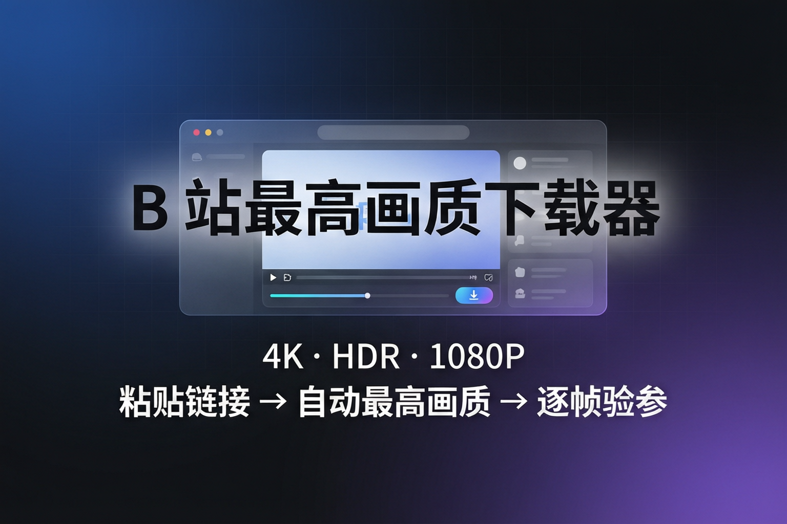

# B站最高画质下载器

[](https://github.com/BokutianGb/bili-hd-downloader/stargazers)
[](https://github.com/BokutianGb/bili-hd-downloader/releases)
[](https://github.com/BokutianGb/bili-hd-downloader/releases)
[]()
[]()



> **粘贴 B 站链接 → 自动登录态最高画质下载 → 下载后逐帧验参(真实帧数、帧率、编码)**

一句话:你看到的最高画质,它都能下到本地。不是信网页上标的数字,是 ffprobe -count_frames 逐帧数的。

---

## 为什么你需要它

打开 B 站想下载一个视频,你会发现:

| 你想做的事 | 实际遇到的墙 |
|---|---|
| 下 1080P+ | 要登录,浏览器 F12 拷出来的链接几分钟就过期 |
| 下 4K/8K/杜比 | 要大会议,而且视频流和音频流是分开的 |
| 下载后剪辑/分析 | 下回来不知道真实帧率是多少,容器声明可能不准 |
| 换个电脑再用 | 从头再来一遍,登录、找工具、调参数 |

**这个工具一次性解决所有问题**:自动抓登录态、自动选最高流、自动合并、自动验参。解压 → 双击 → 两步搞定。

---

## 核心功能

- **一键抓取登录 Cookie**:以独立调试模式启动 Edge(不碰你日常浏览器),打开 B 站,扫码登录一次自动抓取,有效期约半年
- **三档画质按需选择**:
  - 最高画质(大会员 4K/8K/杜比)
  - 最高·优先 H.264(同分辨率优先 x264 编码,兼容性最好)
  - 1080P·H.264(最兼容,无需大会员)
- **自动音视频合并**:B 站视频流和音频流分离,yt-dlp + ffmpeg 自动下载合并为单一 mp4
- **下载后自动逐帧验参**:调用 ffprobe -count_frames 真实数出每一帧,输出:
  - `r_frame_rate` vs `avg_frame_rate` → 判断是恒定帧率(CFR)还是可变帧率(VFR)
  - `nb_read_frames` 真实帧数(不是元数据声明的)
  - 编码格式、分辨率、像素格式、音频参数
- **工具自动更新**:yt-dlp / ffmpeg 不冻结进 exe,B 站接口变化时删掉 tools/ 目录重开即可更新

---

## 验参能力(这是真功夫)

下载完后自动输出这样一份报告,不是糊弄人的:

```
时长: 90.18 秒 | 大小: 150.2 MB
视频流: h264(High) 1920x1080 yuv420p
  帧率声明: 50/1 | 实测平均: 49.93 | 真实帧数: 4503
音频流: aac 48000Hz
```

看得懂的人自然会明白这段信息的意义:
- `r_frame_rate = avg_frame_rate` → 视频是 CFR,帧率声明可信
- 如果两者不一致 → 视频是 VFR,任何单一帧率数字都不能信
- `90.18 x 50 = 4509`,实测 4503,差 6 帧 → 关键帧剪切产生的物理误差,**这证明数字是真的**——如果是编的不会出现这种误差

---

## 快速开始

1. 前往 [Releases](https://github.com/BokutianGb/bili-hd-downloader/releases) 下载 `BiliHDDownloader_v1.0.zip`
2. 解压到任意文件夹,双击 `B站最高画质下载器.exe`
3. 按界面编号顺序:**
   - **① 点"抓取/更新登录Cookie"** → 弹 Edge 窗口 → 扫码登录 B 站(只需一次,半年有效)
   - **② 粘贴视频链接**
   - **③ 选画质档位**
   - **④ 选择保存目录**
   - **⑤ 点"开始下载"**

下载完成自动弹出验参结果。

首次运行会自动下载 yt-dlp(视频解析引擎)和 ffmpeg(音视频合并工具),共约 60MB。

---

## 技术栈


| 组件 | 用途 |
|---|---|
| **yt-dlp** | 解析 B 站视频流地址,支持登录态/大会员/多清晰度 |
| **FFmpeg + FFprobe** | 合并分离的音视频流、逐帧验参 |
| **Chrome DevTools Protocol** | 通过 Edge 远程调试端口抓取登录 Cookie |
| **Tkinter** | 原生 GUI,零额外依赖,打包进单文件 exe |
| **PyInstaller** | 一键打包为单文件 exe,不含运行时工具(tools 首次运行自动下载) |

---

## 安全说明

- **你的 B 站登录 Cookie 只存在你本机**(exe 同目录 cookies.txt),不上传、不入包、不入库
- 本工具不上传任何数据,只做下载
- .gitignore 三重排除 cookies.txt / tools / downloads,发布包制作脚本内置防御性检查
- 请遵守 B 站用户协议及相关法律法规,仅用于个人学习研究

---

**如果这个项目帮到了你,点一下 Star,让更多人看到。**

---

*B站最高画质下载器 - 不把时间浪费在找工具上*